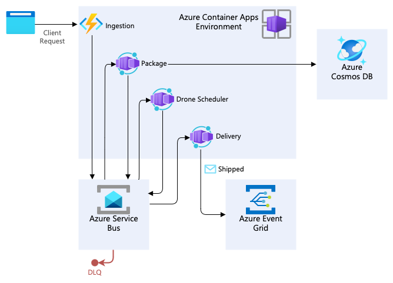

# Choregraphy pattern example

The [Choreography cloud design pattern](https://learn.microsoft.com/azure/architecture/patterns/choreography) does not have code associated with it. You'll find an example of this pattern in the Example section of that article.

The scenario presented is how code running in an Azure Container Apps can use a message broker to exchange messages without central coordination to process a business transaction that requires ordered handling of unbounded sequences of related messages. The scenario uses a [Drone Delivery app](https://github.com/mspnp/microservices-reference-implementation).

## Related documentation

- [Choose between Azure messaging services](https://learn.microsoft.com/azure/service-bus-messaging/compare-messaging-services)
- Use asynchronous distributed messaging through the [publisher-subscriber pattern](https://learn.microsoft.com/azure/architecture/patterns/publisher-subscriber)
- Managing consistency issues implementing [Saga](https://learn.microsoft.com/azure/architecture/reference-architectures/saga/saga)

## Contributions

Please see our [contributor guide](../CONTRIBUTING.md).

This project has adopted the [Microsoft Open Source Code of Conduct](https://opensource.microsoft.com/codeofconduct/). For more information, see the [Code of Conduct FAQ](https://opensource.microsoft.com/codeofconduct/faq/) or contact <opencode@microsoft.com> with any additional questions or comments.

With :heart: from Microsoft Patterns & Practices, [Azure Architecture Center](https://aka.ms/architecture).
