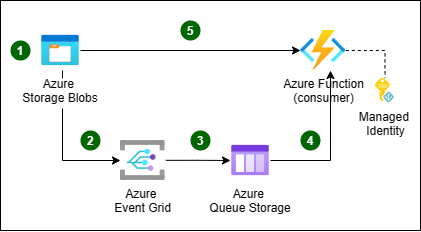

# Sample 1: Automatic Tag Generation, Queues as Message Bus

## Technologies used: Azure Blob Storage, Azure Event Grid, Azure Functions, Azure Storage Queue, .NET Core 2.1

In this example we're using Blob Store to store data, but any service that supportes Event Grid integration can be used too. A client just needs to drop the payload to be shared into the designated Azure Blob Store and Event Grid will automatically generate a Claim Check message and send it to one of the supported message bus. In this sample the message bus is created using Azure Storage Queues. This allows a client application to poll the queue, get the message and then use the stored reference data to download the payload directly from Azure Blob Storage.
The same message, without the need to go through a message bus, can also be directly consumed via Azure Function, leveraging in this case the serverless nature of both Azure Event Grid and Azure Functions.



## Prerequisites

If you don't have an Azure subscription, create a [free account](https://azure.microsoft.com/free/?ref=microsoft.com&utm_source=microsoft.com&utm_medium=docs&utm_campaign=visualstudio) before you begin.

In addition:

* [Visual Studio 2017](https://visualstudio.microsoft.com/downloads/) or  [Visual Studio Code](https://code.visualstudio.com/)
* [.NET Core SDK](https://dotnet.microsoft.com/download)
* [Git](https://www.git-scm.com/downloads)
* [Azure CLI](https://docs.microsoft.com/en-us/cli/azure/install-azure-cli)
* [Azure Storage Explorer](https://azure.microsoft.com/en-us/features/storage-explorer/)

## Getting Started

Make sure you have WSL (Windows System For Linux) installed and have AZ CLI version > 2.0.50. Before running any script also make sure you are authenticated on AZ CLI using

```bash
az login
```

and have selected the Azure Subscription you want to use for the tests:

```bash
az account list --output table
az account set --subscription "<YOUR SUBSCRIPTION NAME>"
```

## Clone the sample project

Clone the repository and open the code-samples directory from your command line tool.

```bash
git clone https://github.com/mspnp/cloud-design-patterns.git
cd cloud-design-patterns/claim-check/code-samples/sample-1
```

## Run Azure Setup Script

Run the azure setup script to get the resources deployed and everything set up

```bash
./sample-1-azure-setup.sh <unique-name>
```

"unique-name" should be something that is unlikely to be used by someone else. This is needed to make sure that no conflict with other people running the same sample at the same time will arise. The name should only contains numbers and letters should not be longer than 12 characters (as additional text will be added by the script itself to identify each created resource) If you're not sure about what to use here, you can just generate a random string using the following bash command:

```bash
echo `openssl rand 5 -base64 | cut -c1-7 | tr '[:upper:]' '[:lower:]' | tr -cd '[[:alnum:]]._-'`
```

This script will create

* a resource group
* a V2 storage account and storage queue
* an event grid topic and subscriptions
* a function app in an app service plan
* an application insights service

Copy the Connection string values displayed at the end of this script on execution. These will be used later.

## Running the sample

There are two applications provided as sample: one to be executed on premises, the other one to be executed on Azure. In order to generate a Claim Check message you just have to drop a file in the created Azure Storage account. You can use Azure Storage Explorer to do that.

### On-Premises Claim Check message consumption

The "client-consumer" is a sample console application that monitors the created Azure Storage Queue for Claim Check messages sent by Azure Event Grid. The application reads the Claim Check message and downloads the blob mentioned in the message itself using Azure Storage SDK.

Azure Event grid is already configured to send data to Event Hubs by the `sample-1-azure-setup.sh` script:

```bash
  az eventgrid event-subscription create
    --name "queue"
    --endpoint "<storage-queue-resoure-id>"
    --endpoint-type "storagequeue"
    --included-event-types "Microsoft.Storage.BlobCreated"
    --source-resource-id "<storage-account-resoure-id>"
```

The script will also automatically configure `App.config` so that the consumer application will point to the created resources. Run the consumer application locally:

```bash
cd client-consumer
dotnet run
```

You are now ready to drop a payload in Blob Storage to see the Claim Check pattern working. [Refer this to know how to upload blobs to a container using Storage Explorer](https://docs.microsoft.com/en-us/azure/storage/blobs/storage-quickstart-blobs-storage-explorer#upload-blobs-to-the-container).

### Serverless Claim Check message consumption

The "azure-function" sample shows how easy is to set up a complete serverless solution to process Claim Check messages using Azure Event Grid and Azure Functions. There is no need to have an intermediate message bus here, as Azure Event Grid can execute Azure Function directly, just by creating a subscription to the Azure Storage account events. This is already done by the `sample-1-azure-setup.sh` script:

```bash
  az eventgrid event-subscription create
    --name "function"
    --included-event-types "Microsoft.Storage.BlobCreated"
    --endpoint "https://myfunctionapp.azurewebsites.net/api/ClaimCheck"
    --endpoint-type "webhook"
    --source-resource-id "<storage-account-resoure-id>"
```

The sample Azure Function will only get the Claim Check message, extract the payload address and log it. You can see the logged messages using the Application Insight resource, searching for TRACE messages created in the last 24h. Here's a sample query you can use:

```
traces
| where operation_Name == "ClaimCheck" and timestamp  > ago(12h) and customDimensions.Category == 'Function.ClaimCheck.User'
| order by timestamp desc
```

You will see log messages like the following:

```text
Got BlobCreated event data, blob URI https://pnp1ccstorage.blob.core.windows.net/sample/my-sampl-big-file.jpg
```

## Cleanup

To complete cleanup of your solution, since this will create a dedicated resource group for the sample, you can just delete the entire resource group:

```bash
az group delete -n <unique-name>
```
