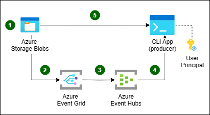

# Sample 2: Automatic Tag Generation, Event Hubs as Message Bus

### Technologies used: Azure Blob Storage, Azure Event Grid, Azure Event Hub, .NET Core 2.1

Very similarly to the Sample 1, a reference message is automatically generated by [Event Grid](https://azure.microsoft.com/en-us/services/event-grid/) as soon as a payload is dropped in the designated Azure Blob Storage. Here the message bus is implemented via Event Hub, so that a client can register itself to be notified each time there is a message in the bus.
Event Hub is also configured so that it [automatically archives](https://docs.microsoft.com/en-us/azure/event-hubs/event-hubs-capture-overview) received messages that are then available as an Avro file which is easily queryable using tools like Apache Spark, Apache Drill or any of the Avro libraries available.



## Prerequisites

If you don't have an Azure subscription, create a [free account](https://azure.microsoft.com/free/?ref=microsoft.com&utm_source=microsoft.com&utm_medium=docs&utm_campaign=visualstudio) before you begin.

In addition:

* [Visual Studio 2017](https://visualstudio.microsoft.com/downloads/) or  [Visual Studio Code](https://code.visualstudio.com/)
* [.NET Core SDK](https://dotnet.microsoft.com/download)
* [Git](https://www.git-scm.com/downloads)
* [Azure CLI](https://docs.microsoft.com/en-us/cli/azure/install-azure-cli)
* [Azure Storage Explorer](https://azure.microsoft.com/en-us/features/storage-explorer/)

## Getting Started
Make sure you have WSL (Windows System For Linux) installed and have AZ CLI version > 2.0.50. Before running any script also make sure you are authenticated on AZ CLI using

```bash
az login
```

and have selected the Azure Subscription you want to use for the tests:

```bash
az account list --output table
az account set --subscription "<YOUR SUBSCRIPTION NAME>"
```

## Clone the sample project

Clone the repository and open the code-samples directory from your command line tool.

```bash
git clone https://github.com/mspnp/cloud-design-patterns.git claimncheck
cd claimncheck/code-samples
```

## Run Azure Setup Script

Run the azure setup script to get the resources deployed and everything set up

```bash
./sample-2-azure-setup.sh
```

This script will create

* a resource group
* a V2 storage account and storage queue
* an event grid topic and subscriptions 
* a function app in an app service plan
* an application insights service

Copy the Connection string values displayed at the end of this script on execution. These will be used later.

## Running the sample

There are two applications provided as sample: one to be executed on premises, the other one to be executed on Azure. In order to generate a Claim Check message you just have to drop a file in the created Azure Storage account. You can use Azure Storage Explorer to do that. 

### On-Premises Claim Check message consumpion

The "client-consumer" is a sample console application that monitors the created Azure Storage Queue for Claim Check messages sent by Azure Event Grid. The application reads the Claim Check message and downloads the blob mentioned in the message itself using Azure Storage SDK.

Azure Event grid is already configured to send data to Event Hubs by the `sample-2-azure-setup.sh` script:

```bash
  az eventgrid event-subscription create
    --name "eventhub"
    --endpoint "<event-hub-resoure-id>"
    --endpoint-type "eventhub"
    --included-event-types "Microsoft.Storage.BlobCreated"
    --source-resource-id "<storage-account-resoure-id>"
```

Before running the console application, you need to point it to the used Azure Storage Account and Azure Event Hub. To do that, simply access the console application by opening the below solution in VS2017 or just open the folder using Visual Studio Code:

```bash
./sample-2/client-consumer/client-consumer.sln
```

Open the App.config file in the solution and update the connection strings and queue name information obtained earlier on running the `sample-2-azure-setup.sh` script in this file. Set a download destination that works for your environment. By defalt it is set to be `C:\Temp`.

```xml
<appSettings>
  <add key="EventHubConnectionString" value=""/>
  <add key="StorageConnectionString" value=""/>
  <add key="DownloadDestination" value="C:\Temp"/>
</appSettings>
```

After making above update, run the console application locally.

You are now ready to drop a payload in Blob Storage to see the Claim Check pattern working. [Refer this to know how to upload blobs to a container using Storage Explorer](https://docs.microsoft.com/en-us/azure/storage/blobs/storage-quickstart-blobs-storage-explorer#upload-blobs-to-the-container).

### Serverless Claim Check message consumpion

The "azure-function" sample shows how easy it is to set up a complete serverless solution to process Claim Check messages using Azure Event Grid and Azure Functions. There is no need to have an intermediate message bus here, as Azure Event Grid can execute Azure Function directly, just by creating a subscription to the Azure Storage account events. This is already done by the `sample-2-azure-setup.sh` script:

```bash
  az eventgrid event-subscription create
    --name "function"
    --included-event-types "Microsoft.Storage.BlobCreated"
    --endpoint "https://myfunctionapp.azurewebsites.net/api/ClaimCheck"
    --endpoint-type "webhook"
    --source-resource-id "<storage-account-resoure-id>"
```

The sample Azure Function will only get the Claim Check message, extract the payload address and log it. You can see the logged messages using the Application Insight resource, searching for TRACE messages created in the last 24h. You will see log messages like the following:

```text
Got BlobCreated event data, blob URI https://pnp1ccstorage.blob.core.windows.net/sample/my-sampl-big-file.jpg
```

## Cleanup

To complete cleanup of your solution, since this will create a dedicated resource group for the sample, you can just delete the entire resource group:

```bash
az group delete -n pnp2
```