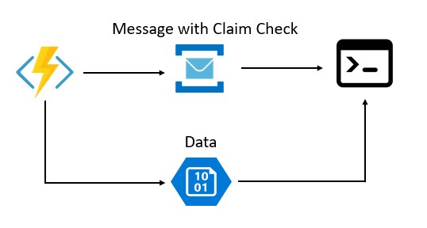
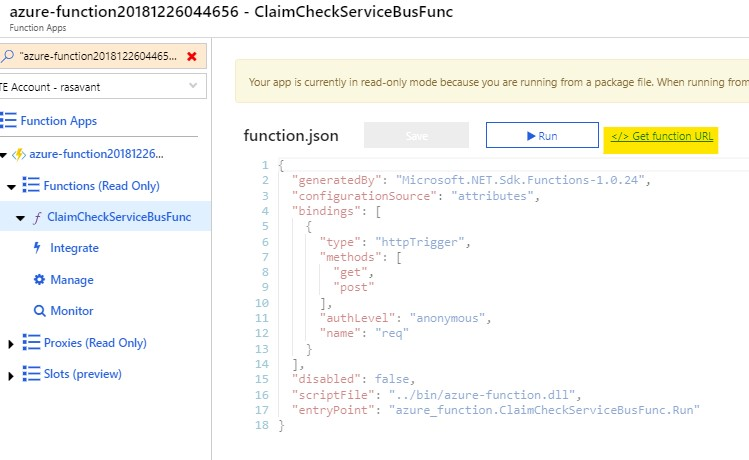

# Sample 3: Plugin support, Service Bus as Message Bus

### Technologies used: Azure Blob Storage, Azure Service Bus, .NET Core 2.1**

This sample takes advantage of the [ServiceBus.AttachmentPlugin](https://www.nuget.org/packages/ServiceBus.AttachmentPlugin) which brings the claim check pattern implementation to Service Bus. The plugin is used to convert any message body into an attachment which gets stored in Azure Blob Storage on message send. Internally, service bus message is used to act as a notification queue which can subscribed on to read the message. On message receive, the plugin makes it possible to directly read the message data from blob storage in the consumer. You can then chose how you want to process the message further. The good thing about this approach is, it obscures the actual claim check workflow from the end user.



## Prerequisites

If you don't have an Azure subscription, create a [free account](https://azure.microsoft.com/free/?ref=microsoft.com&utm_source=microsoft.com&utm_medium=docs&utm_campaign=visualstudio) before you begin.

In addition:

* [Visual Studio 2017](https://visualstudio.microsoft.com/downloads/) or  [Visual Studio Code](https://code.visualstudio.com/)
* [.NET Core SDK](https://dotnet.microsoft.com/download)
* [Git](https://www.git-scm.com/downloads)
* [Azure CLI](https://docs.microsoft.com/en-us/cli/azure/install-azure-cli)
* [Azure Storage Explorer](https://azure.microsoft.com/en-us/features/storage-explorer/)

## Getting Started
Make sure you have WSL (Windows System For Linux) installed and have AZ CLI version > 2.0.50
Before running any script make sure you are authenticated on AZ CLI using

```bash
az login
```

and have selected the Azure Subscription you want to use for the tests:

```bash
az account list --output table
az account set --subscription "<YOUR SUBSCRIPTION NAME>"
```

## Clone the sample project

Clone the repository and open the code-samples directory from your command line tool.

```bash
git clone https://github.com/mspnp/cloud-design-patterns.git claimncheck
cd claimncheck/code-samples
```

## Run Azure Setup Script

Run the azure setup script to get the resources deployed and everything set up

```bash
./sample-3-azure-setup.sh
```

This script will create

* a resource group
* a V2 storage account
* a storage account container
* a service bus namespace, service bus and service bus queue
* a function app in an app service plan
* an application insights service

Copy the Connection string values displayed at the end of this script on execution. These will be used later.

## Running the sample

The Azure Function is used to demonstrate a client application that acts as the initial processor for the large payload.
This could be replaced with any other console application with similar code

Use the Azure Function URL obtained from the portal as shown below



Send a post request on the URL obtained using a message which acts as your large payload

```bash
curl -H "Content-Type: application/json" -X POST https://<yourapp>.azurewebsites.net/api/ClaimCheck -d "This is the large payload test"
```

or, if you want to try sending something bigger:

```bash
curl -H "Content-Type: application/json" -X POST https://<yourapp>.azurewebsites.net/api/ClaimCheck -d @sample-3/readme.md
```

The Azure Function code uses the Service Bus plugin which drops the payload as a blob in the Storage Account created earlier and also sends a notification to consumer client using Service Bus Queue.

Access the console application by opening the below solution in VS2017:

```bash
./claimncheck/code-samples/sample-3/client-consumer/client-consumer.sln
```

Open the App.config file in the solution and update the connection strings and queue name information obtained earlier on running the ```sample-3-azure-setup.sh``` script in this file.

```xml
<appSettings>
    <add key="STORAGE_CONNECTION_STRING" value=""/>
    <add key="SERVICE_BUS_CONNECTION_STRING" value=""/>
    <add key="QUEUE_NAME" value="pnp3sbq"/>
  </appSettings>
```

After making above update, run the console application locally. This console application acts as the consumer client and on running will process the Service Bus message and retrieve the payload message from blob storage.

Please note: For demo purposes, the console application prints payload content on the screen. So keep that in mind if you want to try sending really large payloads.

## Cleanup

To complete cleanup of your solution, since this will create a dedicated resource group for the sample, you can just delete the entire resource group:

```bash
az group delete -n pnp3
```