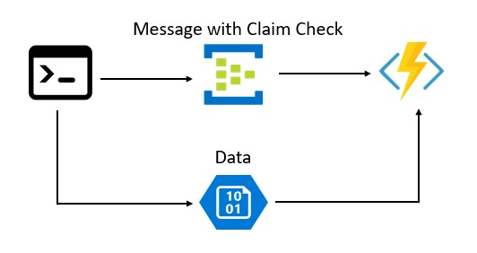

# Sample 4: Manual Tagging

## Technologies used: Azure Blob Storage, Azure Event Hubs with Kafka, .NET Core 2.1

The reason this example uses Event Hubs with Kafka is to demonstrate the ease of using other Azure services like Azure Blob Storage, Azure functions etc. with a different messaging protocol like Kafka from your existing Kafka clients to implement the claim check messaging pattern.
This sample consists of a Kafka client which drops the payload in the designated Azure Blob Storage and creates a notification message with location details to be sent to the consumer. The notification message is sent using [Event Hubs with Kafka enabled](https://docs.microsoft.com/en-us/azure/event-hubs/event-hubs-create-kafka-enabled).  
The consumer is notified each time these is a message in the Event Hub and can access the payload using the location information in the message received.



## Prerequisites

If you don't have an Azure subscription, create a [free account](https://azure.microsoft.com/free/?ref=microsoft.com&utm_source=microsoft.com&utm_medium=docs&utm_campaign=visualstudio) before you begin.

In addition:

* [Visual Studio 2017](https://visualstudio.microsoft.com/downloads/) or  [Visual Studio Code](https://code.visualstudio.com/)
* [.NET Core SDK](https://dotnet.microsoft.com/download)
* [Git](https://www.git-scm.com/downloads)
* [Azure CLI](https://docs.microsoft.com/en-us/cli/azure/install-azure-cli)
* [Azure Storage Explorer](https://azure.microsoft.com/en-us/features/storage-explorer/)

## Getting Started

Make sure you have WSL (Windows System For Linux) installed and have AZ CLI version > 2.0.50
Before running any script make sure you are authenticated on AZ CLI using

```bash
az login
```

and have selected the Azure Subscription you want to use for the tests:

```bash
az account list --output table
az account set --subscription "<YOUR SUBSCRIPTION NAME>"
```

## Clone the sample project

Clone the repository and open the code-samples directory from your command line tool.

```bash
git clone https://github.com/mspnp/cloud-design-patterns.git
cd claim-check/code-samples/sample-4
```

## Run Azure Setup Script

Run the azure setup script to get the resources deployed and everything set up

```bash
./sample-4-azure-setup.sh <unique-name>
```

"unique-name" should be something that is unlikely to be used by someone else. This is needed to make sure that no conflict with other people running the same sample at the same time will arise. The name should only contains numbers and letters should not be longer than 12 characters (as additional text will be added by the script itself to identify each created resource) If you're not sure about what to use here, you can just generate a random string using the following bash command:

```bash
echo `openssl rand 5 -base64 | cut -c1-7 | tr '[:upper:]' '[:lower:]' | tr -cd '[[:alnum:]]._-'`
```

This script will create

* a resource group
* a V2 storage account
* a storage account container
* an event hub namespace with Kafka enabled, event hub
* a function app in an app service plan
* an application insights service

## Running the sample

The script `sample-4-azure-setup.sh` had automatically configured `App.config` so that the consumer application points to the created resources. Run the consumer application locally:

```bash
cd client-consumer
dotnet run
```

This console application will create a test file on your local machine which acts as the large payload and uploads it to blob storage. The console application is a Kafka client producer which then sends a Kafka message with the blob details as a notification to your Event Hub.

The Kafka message will contain something like this:

```json
  {
    "ContainerName":"heavypayload0fc21425-5df3-4c0d-930c-9261ee83ad53",
    "BlobName":"HeavyPayload_82db7213-ca94-4aa0-9e65-fb668e51ccc9.txt"
  }
```

The Azure Function is used to demonstrate a client application that acts as the consumer  for the large payload. We have used the Azure Function Event Hub binding here to be notified of an incoming message in the Event Hub.

You can use the Azure portal to see the output of the Azure Function. You can see the logged messages using the Application Insight resource, searching for TRACE messages created in the last 24h. Here's a sample query you can use:

```
traces
| where timestamp  > ago(12h) and operation_Name == "AzFuncConsumer" and customDimensions.Category == 'Function.AzFuncConsumer.User'
| order by timestamp desc
```

## Cleanup

To complete cleanup of your solution, since this will create a dedicated resource group for the sample, you can just delete the entire resource group:

```bash
az group delete -n <unique-name>
```