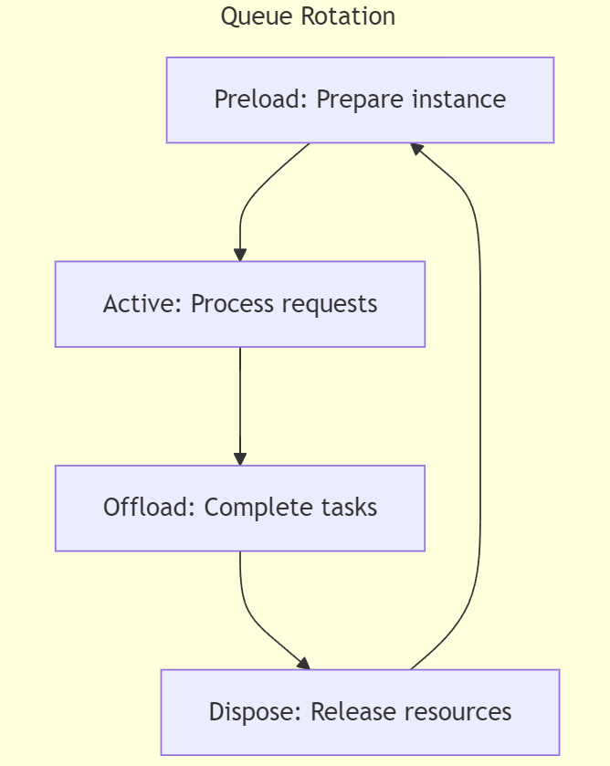

# Resource Conveyor Pattern

## Overview

The **Resource Conveyor Pattern** is a cloud design pattern for efficient lifecycle management of long-running, non-managed external resources such as browser instances, external APIs, or system libraries that degrade over time. This pattern ensures optimal performance by rotating resources in a conveyor-style queue, allowing for preloading, active processing, and safe offloading without new requests.

## Problem Statement

Cloud-based applications often rely on external resources that are prone to degradation over time due to memory leaks, resource exhaustion, or long-running processes. These external resources, such as browser automation, API proxies, or containers, require proper lifecycle management to avoid performance bottlenecks or resource failures.

Existing patterns like **Bulkhead**, **Competing Consumers**, or **Circuit Breaker** help manage faults or isolate resources but do not directly address long-term degradation of non-persistent resources that need constant refreshing.

## Solution

The **Resource Conveyor Pattern** introduces a rotational queue for managing resources efficiently:
- **Three Positions**:
  1. **Preload**: A new instance of the resource is preloaded but not exposed to incoming requests.
  2. **Active**: The instance is actively handling incoming requests.
  3. **Offload**: The instance finishes processing current requests but does not accept new ones and is eventually terminated.
  
- **Rotating Queue**: The conveyor rotates resources at regular intervals, preloading new ones and offloading old ones, ensuring a constant rotation of healthy resources.
  
- **Self-Healing**: If a resource fails, the conveyor continues rotating, keeping the system running smoothly without manual intervention.

## Use Cases

1. **Browser Automation**:
   - Browser instances are known to degrade due to memory leaks. By rotating browser instances in a conveyor-style queue, the system prevents degradation while handling browser-based automation tasks efficiently.

2. **API Proxy Servers**:
   - API proxies that handle large volumes of requests over time can become slow due to resource exhaustion. By rotating proxies, the system ensures optimal performance.

3. **Non-Managed Libraries**:
   - Systems that rely on external, non-managed libraries often experience slowdowns or failures over time. The conveyor ensures that these libraries are periodically recycled to avoid failures.

## Diagram



## Implementation

### Key Components:

1. **Preload Position**: 
   - Preloads new instances of resources before they are needed.
   
2. **Active Position**:
   - Exposes active resources to handle incoming requests.

3. **Offload Position**:
   - Ensures the current resource finishes its existing work without accepting new requests and then terminates.

### Code Example:

```javascript
// Pseudo-code for rotating resource management
async function rotateResources() {
  let preloadInstance = createNewInstance();
  let activeInstance = preloadInstance;
  let offloadInstance;

  setInterval(() => {
    offloadInstance = activeInstance;
    activeInstance = preloadInstance;
    preloadInstance = createNewInstance();

    // Terminate offloaded resource
    terminateInstance(offloadInstance);
  }, ROTATION_INTERVAL);
}


## Advantages

- **Simplicity**: Manages resource rotation automatically, preventing performance degradation over time.
- **Performance**: Maintains optimal resource performance by periodically refreshing resources.
- **Self-Healing**: Recovers from resource failures without manual intervention due to the automatic offloading and rotation of resources.
- **Modular**: Can be applied to various non-managed external resources such as APIs, browser instances, or non-native libraries in cloud environments.

## Trade-offs

- **Overhead**: The continuous rotation of resources introduces overhead, as resources must be regularly preloaded, activated, and offloaded even when not in immediate use.
- **Latency**: There may be slight latency introduced during the switch between active resources, particularly during resource-heavy operations or resource instantiation.

## Related Patterns

- [Bulkhead Pattern](https://learn.microsoft.com/azure/architecture/patterns/bulkhead)
- [Circuit Breaker Pattern](https://learn.microsoft.com/azure/architecture/patterns/circuit-breaker)
- [Competing Consumers Pattern](https://learn.microsoft.com/azure/architecture/patterns/competing-consumers)

## Conclusion

The **Resource Conveyor Pattern** provides an efficient solution for managing the lifecycle of non-managed external resources in cloud-based applications. By ensuring that resources are regularly rotated between preload, active, and offload states, this pattern prevents resource degradation and maintains optimal system performance. It can be applied to various resource-heavy or long-running processes that are prone to memory leaks, performance slowdowns, or resource exhaustion.

With ❤️ from the Azure patterns & practices team, [Azure Architecture Center](https://azure.com/architecture).
