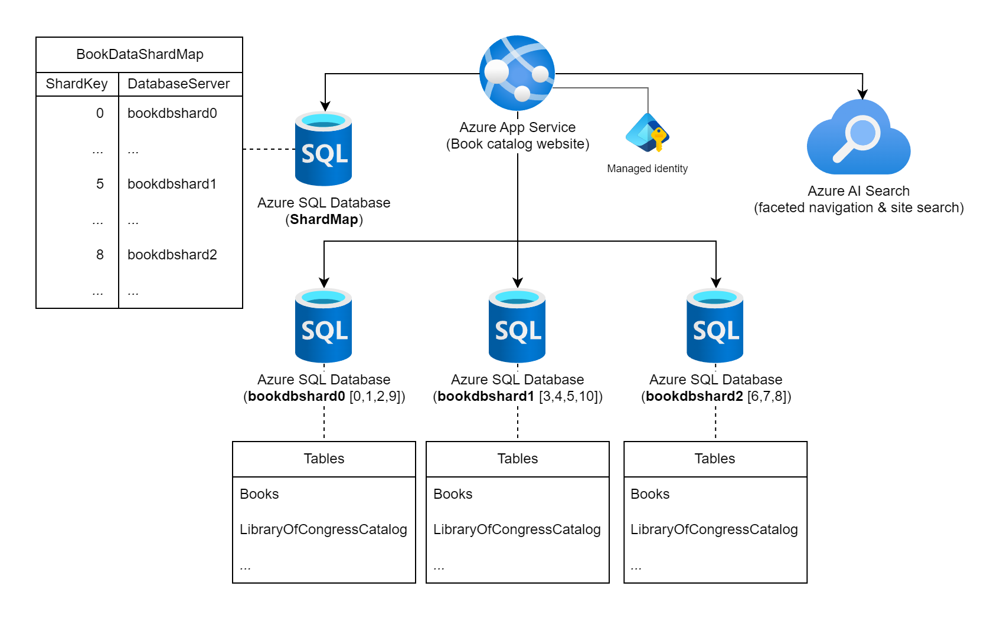

# Sharding pattern example

The [Sharding cloud design pattern](https://learn.microsoft.com/azure/architecture/patterns/sharding) does not have code associated with it. You'll find an example of this pattern in the [Example section](https://learn.microsoft.com/azure/architecture/patterns/sharding#example) of that article.

The scenario presented is how code running in an Azure Web App can use a *lookup* against a managed shard list database to select the correct Azure SQL Database instance for queries. The scenario uses a book cataloging system, with the shard being based off of the books' ISBNs.

## Related documentation

- [Scaling out with Azure SQL Database](https://learn.microsoft.com/azure/azure-sql/database/elastic-scale-introduction)
- [Sharding models in Azure CosmosDB for PostgreSQL](https://learn.microsoft.com/azure/cosmos-db/postgresql/concepts-sharding-models)

## Contributions

Please see our [Contributor guide](../CONTRIBUTING.md).

This project has adopted the [Microsoft Open Source Code of Conduct](https://opensource.microsoft.com/codeofconduct/). For more information see the [Code of Conduct FAQ](https://opensource.microsoft.com/codeofconduct/faq/) or contact <opencode@microsoft.com> with any additional questions or comments.

With :heart: from Azure patterns & practices, [Azure Architecture Center](https://azure.com/architecture).
