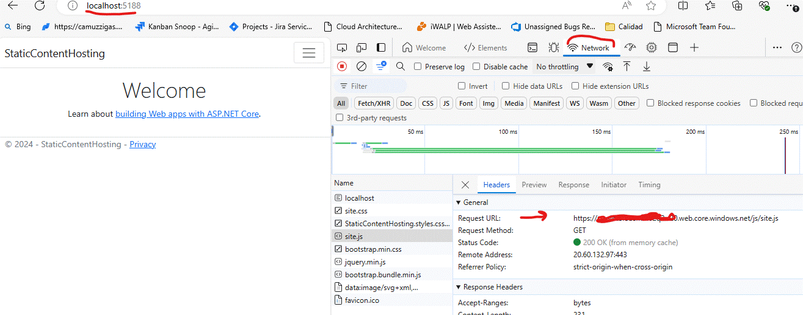

# Static Content Hosting Pattern

This document describes the [Static Content Hosting pattern](https://learn.microsoft.com/azure/architecture/patterns/static-content-hosting).

## Technologies used: Azure Blob Storage, .NET 8.0, ASP.NET Core MVC

This example demonstrates how to reference static content from a publicly accessible storage service using [Static website hosting in Azure Storage](https://learn.microsoft.com/azure/storage/blobs/storage-blob-static-website). It features an ASP.NET MVC application that references CSS files, JavaScript files, and images hosted in an Azure Storage account. Typically, this type of content is deployed to the storage account as part of the application deployment process.

The URLs are generated by an HTML helper class implemented in the file StaticContentUrlHtmlHelper.cs

## :rocket: Deployment guide

Install the prerequisites and follow the steps to deploy and run the examples.

### Prerequisites

- Permission to create a new resource group and resources in an [Azure subscription](https://azure.com/free)
- Unix-like shell. Also available in:
  - [Azure Cloud Shell](https://shell.azure.com/)
  - [Windows Subsystem for Linux (WSL)](https://learn.microsoft.com/windows/wsl/install)
- [Git](https://git-scm.com/downloads)
- [.NET 8 SDK](https://dotnet.microsoft.com/download/dotnet/8.0)
- [Azure CLI](https://learn.microsoft.com/cli/azure/install-azure-cli)
- Optionally, an IDE, like  [Visual Studio](https://visualstudio.microsoft.com/downloads/) or [Visual Studio Code](https://code.visualstudio.com/).

### Steps

1. Clone this repository to your workstation and navigate to the working directory.

   ```bash
   git clone https://github.com/mspnp/cloud-design-patterns
   cd cloud-design-patterns/static-content-hosting
   ```

1. Log into Azure and create an empty resource group.  

   ```bash
   az login
   az account set -s <Name or ID of subscription>

   LOCATION=eastus2
   RESOURCE_GROUP_NAME="rg-static-content-hosting-${LOCATION}"

   az group create -n "${RESOURCE_GROUP_NAME}" -l ${LOCATION}

   ```

1. Deploy the supporting Azure resources.

   ```bash
   CURRENT_USER_OBJECT_ID=$(az ad signed-in-user show -o tsv --query id)
   STORAGE_ACCOUNT_NAME="stvaletblobs$(LC_ALL=C tr -dc 'a-z0-9' < /dev/urandom | fold -w 7 | head -n 1)"

   # This takes about one minute
   az deployment group create -n deploy-valet-key -f bicep/main.bicep -g "${RESOURCE_GROUP_NAME}" -p storageAccountName=$STORAGE_ACCOUNT_NAME principalId=$CURRENT_USER_OBJECT_ID
   ```

1. Enable static website hosting.

   ```bash
   az storage blob service-properties update --account-name $STORAGE_ACCOUNT_NAME --static-website --index-document 'Index.html' --auth-mode login
   ```

1. Configure the samples to use the created Azure resources.

   ```bash
   STATIC_CONTENT_URL=$(az storage account show --name $STORAGE_ACCOUNT_NAME --query "primaryEndpoints.web" --output tsv)
   sed "s|{STATIC_CONTENT_URL}|${STATIC_CONTENT_URL}|g" ./StaticContentHosting/StaticContentHosting/appsettings.json.template > ./StaticContentHosting/StaticContentHosting/appsettings.json
   ```

1. Upload files static files to Azure Storage

   ```bash
   az storage blob upload-batch -s ./StaticContentHosting/StaticContentHosting/wwwroot/ -d '$web' --account-name $STORAGE_ACCOUNT_NAME --auth-mode login
   ```

### :checkered_flag: Try it out

1. Run the ASP.NET Core MVC app

  ```bash
  dotnet run --project ./StaticContentHosting/StaticContentHosting
  ```

  Open the URL from the output of the previous command in a browser (e.g., http://localhost:5188). The output will look like this:

  ```bash
  info: Microsoft.Hosting.Lifetime[14]
      Now listening on: http://localhost:5188
  info: Microsoft.Hosting.Lifetime[0]
      Application started. Press Ctrl+C to shut down.
  ```
  
  By pressing F12, you can open the browser's Developer Tools. In the Network tab, you will see that files, such as site.js, are being downloaded from the storage account.

  

### :broom: Clean up

Remove the resource group that you created when you are done with this sample.

```bash
az group delete -n "${RESOURCE_GROUP_NAME}" -y
```
