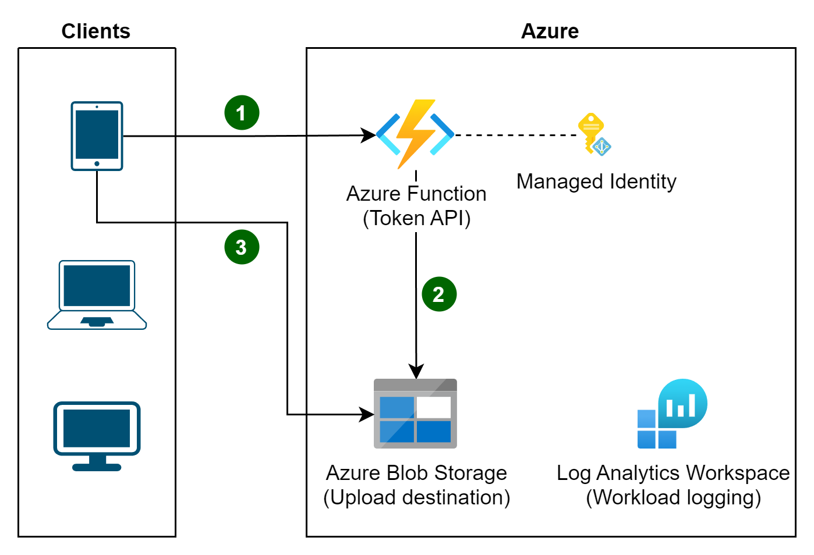

# Valet Key pattern example

This directory contains an example of the [Valet Key cloud design pattern](https://learn.microsoft.com/azure/architecture/patterns/valet-key).

This example shows how a client application can obtain necessary permissions to write directly to a storage destination, bypassing a server component that would not add value and introduce additional latency and risk to the operation.

Specifically this sample includes an Azure Function that provides a scoped, time-limited shared access signature (SaS) to authorized callers, who would then use that SaS token to perform a data upload to the storage account without consuming the resources of the Azure Function to proxy that request.

The typical way to generate a SAS token in code requires the storage account key. In this scenario, storage account keys are disabled and instead an approach called “user delegation” SAS is used. By using a user delegation SAS, you can sign the signature with Microsoft Entra ID credentials instead of the storage account key.



## :rocket: Deployment guide

Install the prerequisites and follow the steps to deploy and run an example of the Valet Key pattern.

### Prerequisites

- Permission to create a new resource group and resources in an [Azure subscription](https://azure.microsoft.com/pricing/purchase-options/azure-account?cid=msft_learn)
- Unix-like shell. Also available in:
  - [Azure Cloud Shell](https://shell.azure.com/)
  - [Windows Subsystem for Linux (WSL)](https://learn.microsoft.com/windows/wsl/install)
- [Git](https://git-scm.com/downloads)
- [.NET 9 SDK](https://dotnet.microsoft.com/download/dotnet/9.0)
- [Azure Functions Core Tools](https://learn.microsoft.com/azure/azure-functions/functions-run-local#install-the-azure-functions-core-tools)
- [Azurite](/azure/storage/common/storage-use-azurite)
- [Azure CLI](https://learn.microsoft.com/cli/azure/install-azure-cli)

### Steps

1. Clone this repository to your workstation and navigate to the working directory.

   ```bash
   git clone https://github.com/mspnp/cloud-design-patterns
   cd valet-key
   ```

1. Log into Azure and create an empty resource group.

   ```bash
   az login
   az account set -s <Name or ID of subscription>

   LOCATION=eastus2
   RESOURCE_GROUP_NAME="rg-valet-key-${LOCATION}"

   az group create -n "${RESOURCE_GROUP_NAME}" -l ${LOCATION}
   ```

1. Deploy destination Azure Storage account.

   ```bash
   CURRENT_USER_OBJECT_ID=$(az ad signed-in-user show -o tsv --query id)
   STORAGE_ACCOUNT_NAME="stvaletblobs$(LC_ALL=C tr -dc 'a-z0-9' < /dev/urandom | fold -w 7 | head -n 1)"

   # This takes about one minute
   az deployment group create -n deploy-valet-key -f bicep/main.bicep -g "${RESOURCE_GROUP_NAME}" -p storageAccountName=$STORAGE_ACCOUNT_NAME principalId=$CURRENT_USER_OBJECT_ID
   ```

1. Configure the API to use this Azure Storage account for its delegation.

   ```bash
   sed "s/STORAGE_ACCOUNT_NAME/${STORAGE_ACCOUNT_NAME}/g" ValetKey.Web/local.settings.template.json > ValetKey.Web/local.settings.json
   ```

1. [Run Azurite](https://learn.microsoft.com/azure/storage/common/storage-use-azurite#run-azurite) blob storage emulation service.

   > The local storage emulator is required as an Azure Storage account is a required "backing resource" for Azure Functions.

1. Start the valet key API.

   ```bash
   cd ValetKey.Web/
   func start
   ```

   > This Azure Function implicitly uses `DefaultAzureCredential` to authenticate to the Azure storage account as your identity with **Storage Blob Delegator**. This must be [configured in your environment](https://learn.microsoft.com/dotnet/azure/sdk/authentication/?tabs=command-line#exploring-the-sequence-of-defaultazurecredential-authentication-methods), and if you followed the instructions it already is with your usage of `az login`. The Azure Function is executing under your identity when running locally.

### :checkered_flag: Try it out

1. Run the client that will ask for and use the valet key.

   _You'll need to run this from another terminal._

   ```bash
   dotnet run --project ValetKey.Client/
   ```

   > The client reaches out to the valet key API and requests a scope and time-limited SaS token for a destination of the API's choosing. The API will generate the sas token and return it to the client along with the destination. The client will use that token to upload a file to that destination. Attempting to use that SaS token for any other purpose will be denied.

1. Validate the blob has been uploaded.

   1. Open the the **Storage browser** on your [Storage account](https://portal.azure.com/#browse/Microsoft.Storage%2FStorageAccounts).
   1. Select **Blob containers**.
   1. Click on the container named `uploads`.
   1. You should be able to see the list of uploaded blobs.

### :broom: Clean up

Remove the resource group that you created when you are done with this sample.

```bash
az group delete -n "${RESOURCE_GROUP_NAME}" -y
```

## Deploying to Azure

The Azure Function can be deployed to Azure and run under a managed identity. The managed identity must have the same role assignments granted to your user in this walkthrough (and your user could technically have those permissions removed). Once the function is running on Azure, there is no need for any local `az login` authentication in this sample; the client (ValetKey.Client) doesn't use it.

## Related documentation

- [Create a user delegation SAS](https://learn.microsoft.com/rest/api/storageservices/create-user-delegation-sas)
- [Publish Azure Function to Azure](https://learn.microsoft.com/azure/azure-functions/functions-run-local#publish)

## Contributions

Please see our [Contributor guide](../CONTRIBUTING.md).

This project has adopted the [Microsoft Open Source Code of Conduct](https://opensource.microsoft.com/codeofconduct/). For more information see the [Code of Conduct FAQ](https://opensource.microsoft.com/codeofconduct/faq/) or contact <opencode@microsoft.com> with any additional questions or comments.

With :heart: from Azure patterns & practices, [Azure Architecture Center](https://azure.com/architecture).
